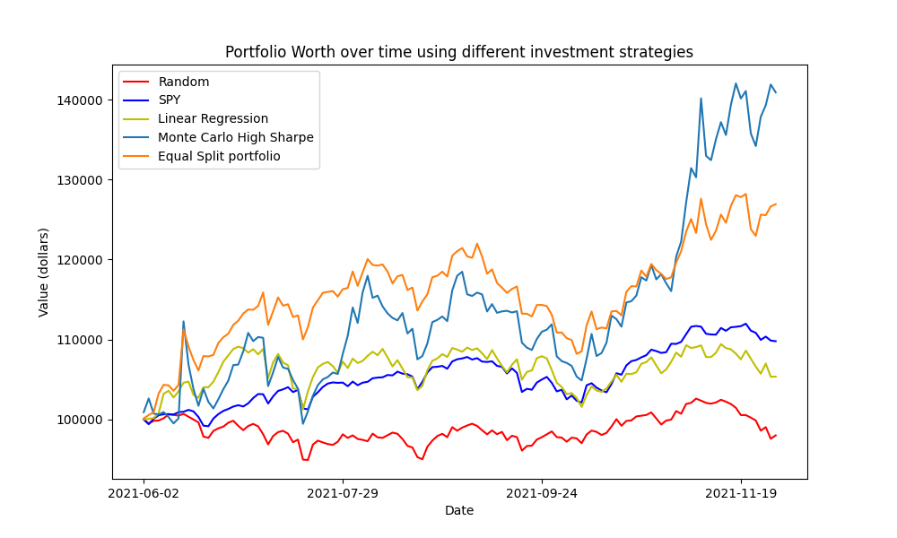
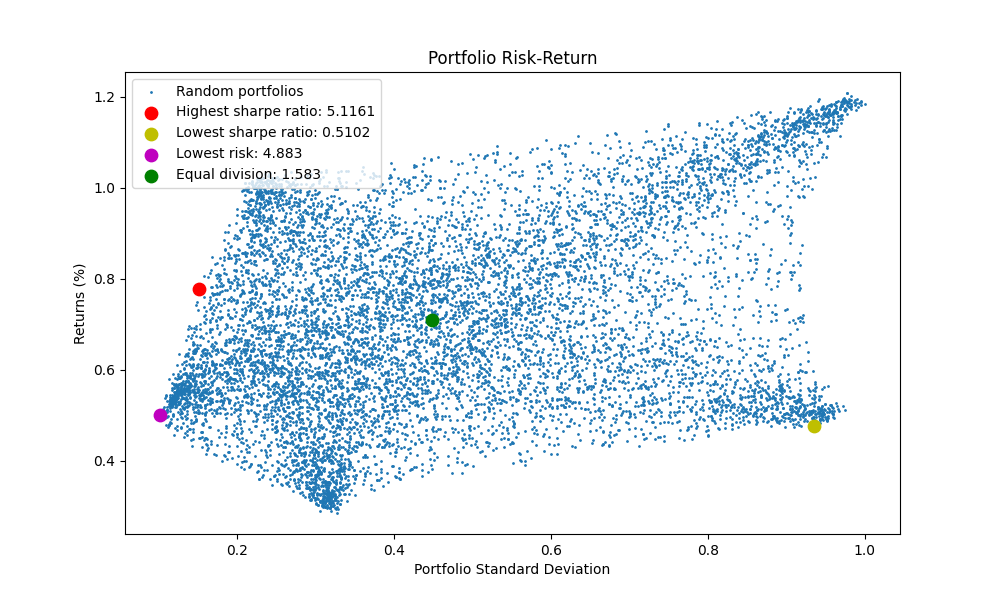
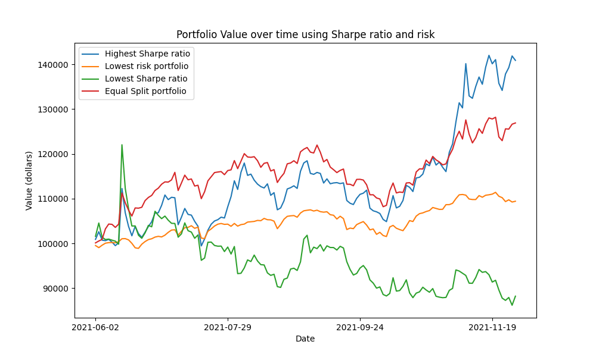
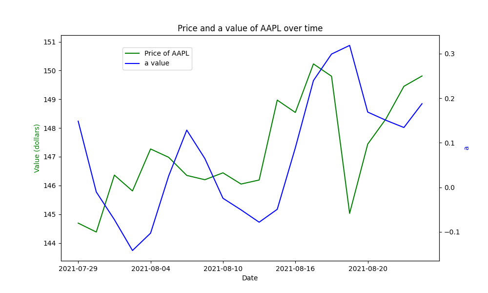

# Algorithmic Trading Backtesting Framework

A Python-based backtesting system for evaluating multiple trading strategies, including Random Allocation, Linear Regression Signals, and Monte Carlo Portfolio Optimization, benchmarked against a SPY buy-and-hold strategy.

---

## Results Preview



**Key Takeaways:**

* Monte Carlo (Sharpe-optimized) strategy significantly outperforms all others
* Random strategy consistently underperforms
* Linear regression fails as a predictive signal due to lag
* Diversified portfolios outperform single-asset strategies (SPY)

---

## Overview

This project implements a modular trading framework designed to simulate and compare different investment strategies over historical stock data.

The system:

* Loads historical price data for hundreds of stocks
* Simulates portfolio evolution over time
* Applies multiple trading strategies
* Evaluates performance against market benchmarks

The primary goal is to explore whether algorithmic strategies can outperform a passive market approach (SPY), a well-known benchmark in finance .

---
## Strategies

### Random Strategy

* Randomly decides whether to buy or sell each stock
* Serves as a baseline for comparison
* Demonstrates that uninformed strategies tend to underperform

---

### Linear Regression Strategy

* Fits a linear model:

  $$
  y = ax + b
  $$

* Uses the slope (a) as a momentum signal:

  * Buy if (a > 1)
  * Sell if (a < -1)

**Key insight:**
Slope tracks price trends but **lags behind actual movement**, making it a weak predictor of future prices .

---

### Monte Carlo Portfolio Optimization

Implements a simulation-based portfolio selection approach:

Steps:

1. Compute daily log returns:
   $$
   \log\left(\frac{P_t}{P_{t-1}}\right)
   $$
2. Generate random portfolio weight allocations
3. Compute expected return:
   $$
   \mathbb{E}[R] = \sum w_i \mu_i
   $$
4. Compute risk via covariance matrix
5. Evaluate portfolios using **Sharpe Ratio**:
   $$
   \frac{\text{Return}}{\text{Volatility}}
   $$

**Key insight:**
Portfolios with higher Sharpe ratios tend to outperform, balancing risk and return .

---

### SPY Baseline Strategy

* Invests 100% in SPY (S&P 500 ETF)
* Serves as the benchmark to beat

---

## Project Structure

```
Stock-Trading-Algorithms/
│
├── GettingStockData/
│   ├── GetStockData.py        # Script to download stock data from Yahoo Finance
│   └── symbol_1500.json       # List of stock tickers
│
├── Results/                   # Generated plots used in analysis and README
│
├── StockData/                 # Historical stock CSV files
│
├── LinearRegressionAlg.py     # Linear regression trading strategy
├── MonteCarloAlg.py           # Monte Carlo portfolio optimization
├── PortfolioFunctions.py      # Portfolio execution and valuation utilities
├── PortfolioManager.py        # Main backtesting engine
├── RandomAlg.py               # Random trading strategy
├── SpyBaseCase.py             # SPY benchmark strategy
│
├── Final_Lab.pdf              # Original lab report
└── README.md                 # Project documentation
```
---

## Backtesting Workflow

1. Load stock data and trading dates
2. Initialize portfolio states
3. For each trading day:

   * Generate buy/sell signals from each strategy
   * Execute trades
   * Update portfolio value
4. Compare performance across strategies
5. Visualize results

---

## Results Preview

### Strategy Performance Comparison


The Monte Carlo strategy (highest Sharpe ratio) significantly outperforms all others.
The random strategy underperforms, while SPY provides a strong baseline.

---

### Monte Carlo Risk–Return Tradeoff



Each point represents a simulated portfolio.
Higher-return portfolios generally require higher risk, and the optimal portfolio maximizes risk-adjusted return.

---

### Portfolio Selection via Sharpe Ratio



The highest Sharpe portfolio consistently achieves the strongest performance compared to low-risk and equal-weight portfolios.

---

### Linear Regression Signal Behavior



The regression slope follows price trends but reacts with delay, demonstrating why it is a weak predictive signal.

---

## Key Findings

* Monte Carlo optimization outperforms all other strategies
* Diversification significantly improves performance
* Risk-adjusted metrics (Sharpe ratio) are critical
* Linear regression is not effective as a standalone signal
* Random strategies consistently underperform

---

## Assumptions & Limitations

* No transaction costs or slippage
* Daily price data only (no intraday data)
* Immediate trade execution
* Fixed stock universe
* No market impact

---

## Performance & Complexity

| Strategy          | Complexity |
| ----------------- | ---------- |
| SPY               | O(n)       |
| Random            | O(n²)      |
| Linear Regression | O(n⁴)      |
| Monte Carlo       | O(n⁵)      |

---

## Installation

```bash
pip install yfinance numpy pandas matplotlib scipy
```

---

## Usage

Run the full backtest:

```bash
python PortfolioManager.py
```

---

## Key Learnings

* Simple models often fail in real markets
* Portfolio construction matters more than individual signals
* Risk management is essential for consistent returns

---

## Author

Mike Chen

---

## References

[1] Art B. Owen  
*Monte Carlo Theory, Methods and Examples*  
Stanford University  
[Link](https://web.stanford.edu/~owen/mc/)

[2] Massachusetts Institute of Technology  
*Explained: Monte Carlo Simulations*  
[Link](https://news.mit.edu/2010/explained-monte-carlo)

[3] Farhad Malik  
*Best Investment Portfolio via Monte Carlo Simulation in Python*  
Towards Data Science  
[Link](https://towardsdatascience.com)

[4] Varun Divakar  
*Calculating the Covariance Matrix and Portfolio Variance*  
[Link](https://stackoverflow.com/questions/)

---
## Notes

Originally developed as a computational physics project exploring statistical
and numerical methods applied to financial markets.

